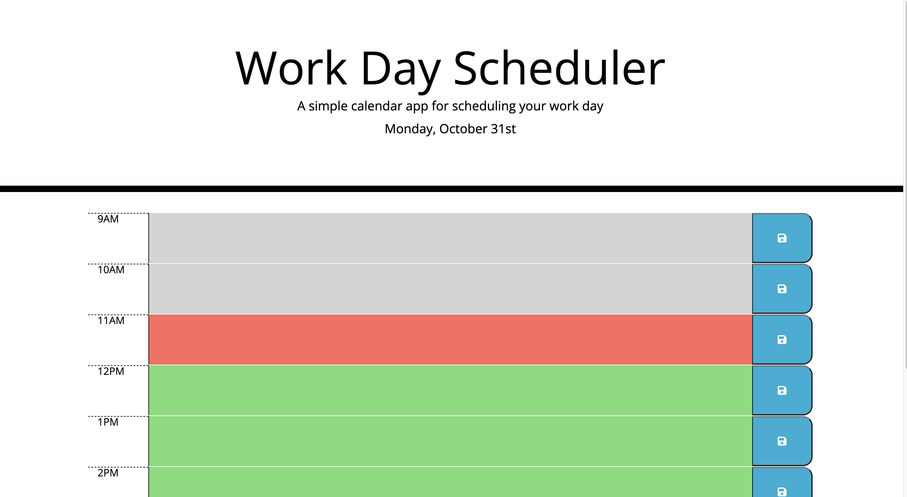

# Challenge 5: Work Day Scheduler

## Description
To create a simple calendar application that allows a user to save events for each hour of the work day. For this application I used the hours from 9am to 5pm.

## Acceptance Criteria

```md
GIVEN I am using a daily planner to create a schedule
WHEN I open the planner
THEN the current day is displayed at the top of the calendar
WHEN I scroll down
THEN I am presented with timeblocks for standard business hours
WHEN I view the timeblocks for that day
THEN each timeblock is color coded to indicate whether it is in the past, present, or future
WHEN I click into a timeblock
THEN I can enter an event
WHEN I click the save button for that timeblock
THEN the text for that event is saved in local storage
WHEN I refresh the page
THEN the saved events persist
```

I utilized Third Party API's to complete this project.

## Installation

N/A

## Usage

[Here is the link to the work day scheduler application.](https://mariea1022.github.io/work-day-scheduler/)

To use this application, enter your event in the timeblocks colored gray, red-orange or green. To save your event on the scheduler, click on the button with the floppy disk icon. If you reload, your saved events will persist on the page.

Below is the image of the work day scheduler application.


## Credits

N/A

## License

Please refer to the LICENSE in the repo.